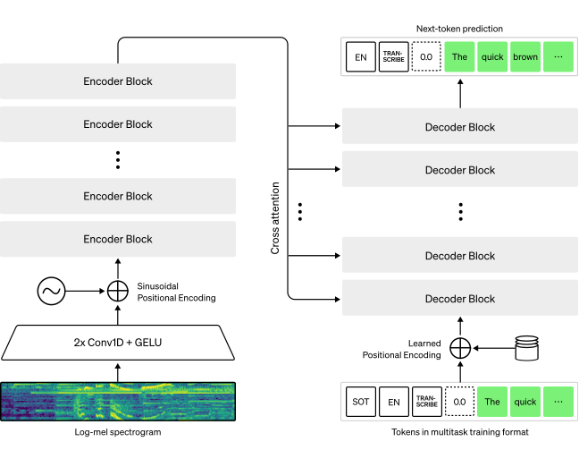

## Introduction

### Whisper
Whisper is a Transformer based encoder-decoder model pre-trained model for automatic speech recognition (ASR) published in September 2022 by OpenAI[^1]. In short, it maps a sequence of audio spectrogram features to a sequence of text tokens. *Figure 1* summarises the Whisper model.

||
|:--:|
|**Figure 1: Whisper model.** The architecture follows the standard Transformer-based encoder-decoder model. A log-Mel spectrogram is input to the encoder. The last encoder hidden states are input to the decoder via cross-attention mechanisms. The decoder autoregressively predicts text tokens, jointly conditional on the encoder hidden states and previously predicted tokens. Figure source: [^1]| 

The **general steps** Whisper performs when given an audio file are the following:

1. First, the raw audio inputs are converted to a log-Mel spectrogram by action of the feature extractor. 
2. The Transformer encoder then encodes the spectrogram to form a sequence of encoder hidden states. 3.
3. Finally, the decoder autoregressively predicts text tokens, conditional on both the previous tokens and the encoder hidden states.

Interestingly, 117,000 hours of this pre-training data is multilingual ASR data, which results in checkpoints that can be applied to transcribe and translate over 96 languages, many of which are considered low-resource. The pre-trained checkpoints achieve competitive results to state-of-the-art ASR systems, with near 3% word error rate (WER) on the test-clean subset of LibriSpeech ASR and a new state-of-the-art on TED-LIUM with 4.7% WER (see Table 8 from the Whisper paper[^2]). The extensive multilingual ASR knowledge acquired by Whisper during pre-training can be leveraged for other low-resource languages; **through fine-tuning, the pre-trained checkpoints can be adapted for specific datasets and languages to further improve upon these results**[^3].

The Whisper checkpoints come in **five configurations of varying model sizes**. The smallest four are trained on either English-only or multilingual data. The largest checkpoint is multilingual only. The checkpoints are summarised in Table 1, and all are available  on the [Hugging Face Hub](https://huggingface.co/models?search=openai/whisper) (links to the models are provided):

| Size |	Layers |	Width |	Heads |	Parameters |	English-only |	Multilingual |
| :-- |	:-- |	:-- |	:-- |	:-- |	:--: |	:--: |
| tiny |	4 |	384 |	6 |	39 M |	[✓](https://huggingface.co/openai/whisper-tiny.en) |	[✓](https://huggingface.co/openai/whisper-tiny) |
| base |	6 |	512 |	8 |	74 M |	[✓](https://huggingface.co/openai/whisper-base.en) |	[✓](https://huggingface.co/openai/whisper-base) |
| small |	12 |	768 |	12 |	244 M |	[✓](https://huggingface.co/openai/whisper-small.en) |	[✓](https://huggingface.co/openai/whisper-small) |
| medium |	24 |	1024 |	16 |	769 M |	[✓](https://huggingface.co/openai/whisper-medium.en) |	[✓](https://huggingface.co/openai/whisper-medium.en) |
| large |	32 |	1280 |	20 |	1550 M |	x |	[✓](https://huggingface.co/openai/whisper-large) |

### Flamenco
Flamenco is a cultural expression originated in the south of Spain (particularly in Andalucia) (XX) which is characterised by its intense emotional expression. Besides flamenco dance and guitar, **flamenco singing (*cante*) is very complex**. Its forms have been influenced by the many cultures that converged in the south of Spain (arabic, jewish, cristian, gypsy, Sub-Saharan Africa...), and its lyrics are a reflex of the cultural heritage of this territory. Many of them are poems, others gather popular knowledge or events that happened in the past (sometimes forgotten), and others tell stories and sayings from previous times.

The __complexity of both the musical and the lyrical aspects of *cante*__ flamenco sometimes **difficult the understanding of the lyrics**, which are a relevant part of *cante*. **This is the main motivation for this project.**

## :octicons-goal-24: Goals
The main goal of this project is to **fine-tune Whisper to optimize the transcription of flamenco**.

## :octicons-project-roadmap-24: Roadmap 
In order to achieve this, I need a large labelled database.

---

## References

[^1]: OpenAI Whisper Blog: [https://openai.com/research/whisper](https://openai.com/research/whisper)
[^2]: OpenAI Whisper paper: [Robust Speech Recognition via Large-Scale Weak Supervision](https://cdn.openai.com/papers/whisper.pdf)
[^3]: Whisper fine-tunning tutorial using Hugging Face: [https://huggingface.co/blog/fine-tune-whisper](https://huggingface.co/blog/fine-tune-whisper)